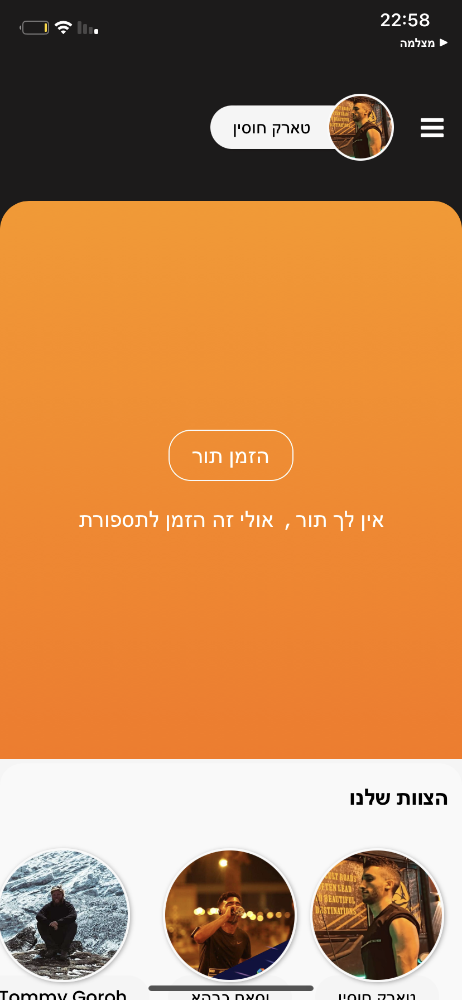
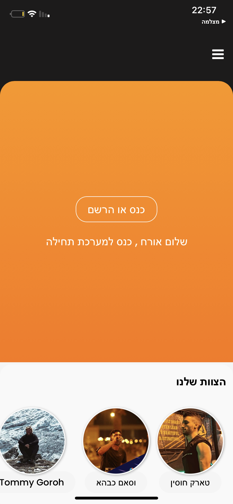
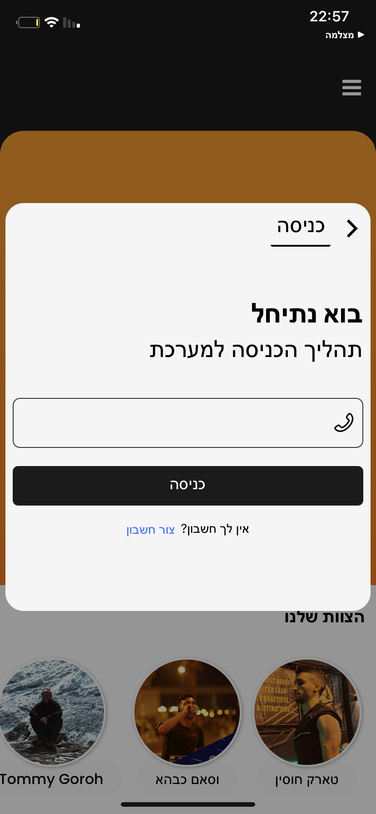
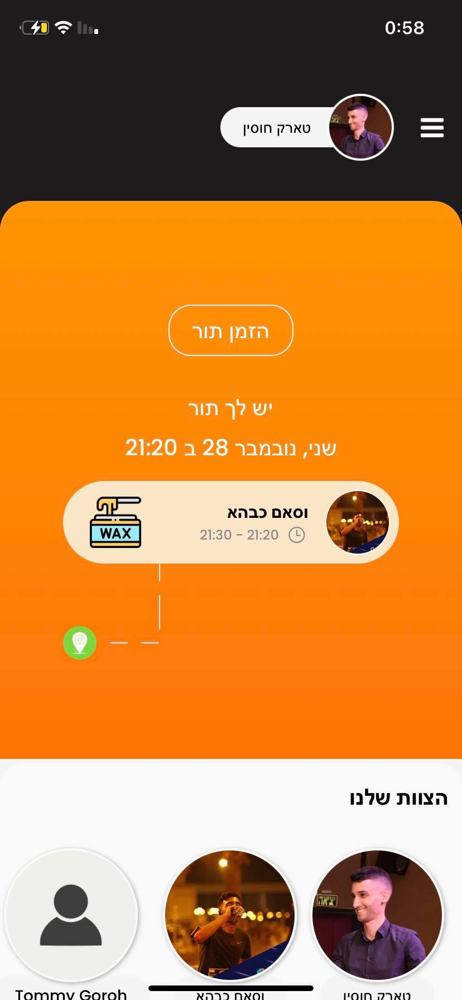
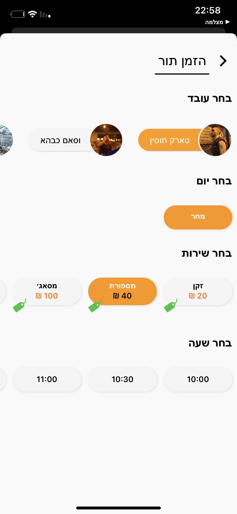
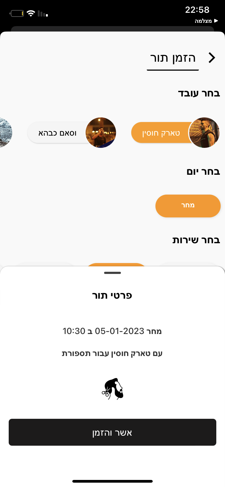
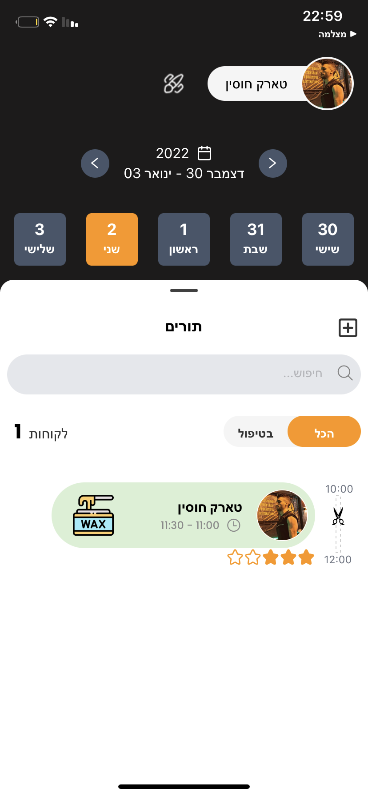
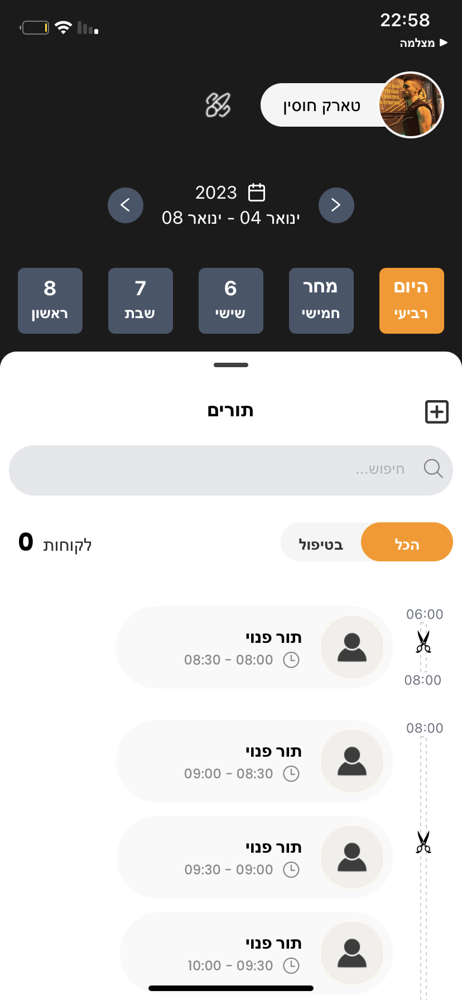
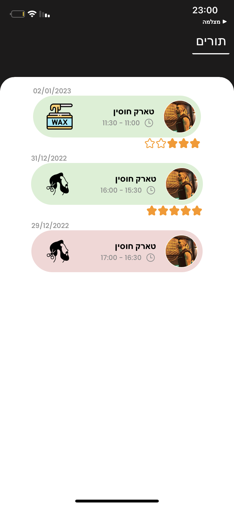
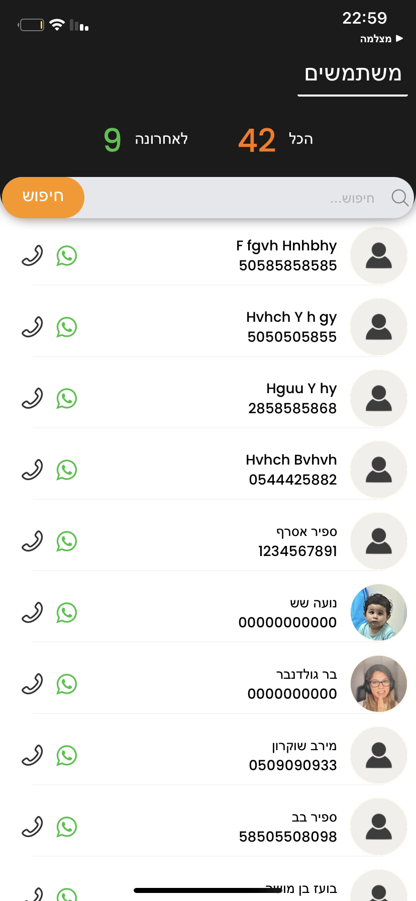

# Appointments

## Project Overview

This is a client appointments app mainly for a barber shop management.

 

## GUI , UI/UX

 

  
   
  
  

  
   
  
  
  

  
   

 
 

## What We Used

- React Native
- Socket io client
- MVVM
- Unidirectional data flow

## Some fetuers

- Employee Managment Page
- Booking appointment
- unbook appointment
- appointment status
- profile
- login and signup
- Auto refresh token
- live updates with socket io

 

## Authors

**Tarik Husin**  - linkedin -> https://www.linkedin.com/in/tarik-husin-706754184/

**Wissam Kabaha**  

